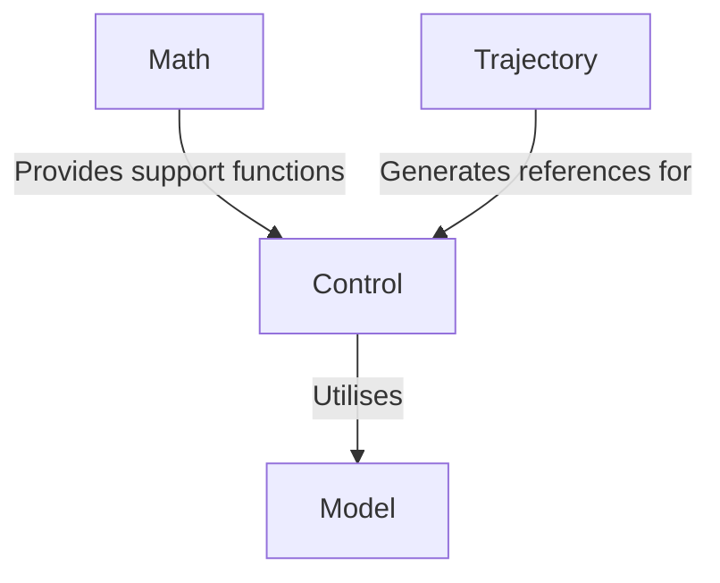
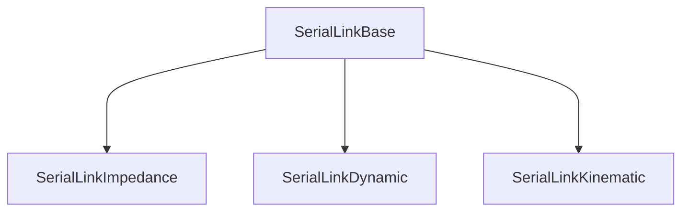

# :control_knobs: Control

[:back: Back to the Foyer](../README.md)

The `Control` sublibrary provides classes for real-time feedback control of robots. At present it is only capable of handling serial link robot arms.

The classes build upon the [Model](../Model/README.md) sublibrary and provide a seamless API to optimise the control of robots subject to actuator constraints. It is designed to integrate with the [Trajectory](../Trajectory/README.md) sublibrary where you can easily generate and pass reference trajectories to the controller.

## Serial Link Robots

There are currently 2 classes available for control of serial link robotics, with a base class providing a standardised structure and API:

  - [SerialLinkBase](doc/SerialLinkBase.md): A base class providing a standardised interface for all serial link control classes.
  - [SerialLinkImpedance](doc/SerialLinkImpedance.md): Computes inertia-free joint and Cartesian impedance control.
  - [SerialLinkKinematic](doc/SerialLinkKinematic.md): For joint trajectory tracking, and Cartesian velocity control (resolved motion rate control).
  - SerialLinkDynamic: Under construction 🏗️.

[:top: Back to Top](#control_knobs-control)
