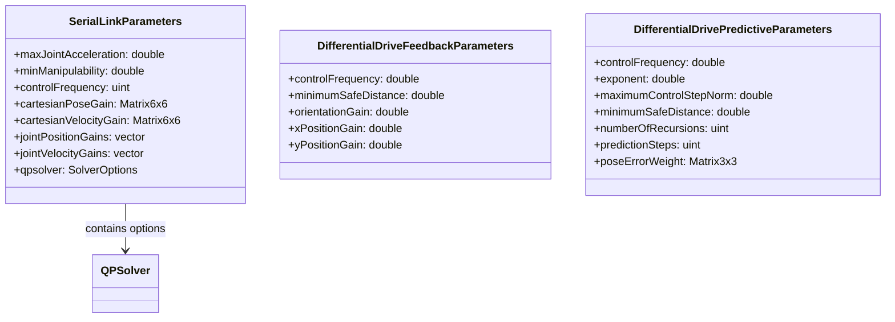
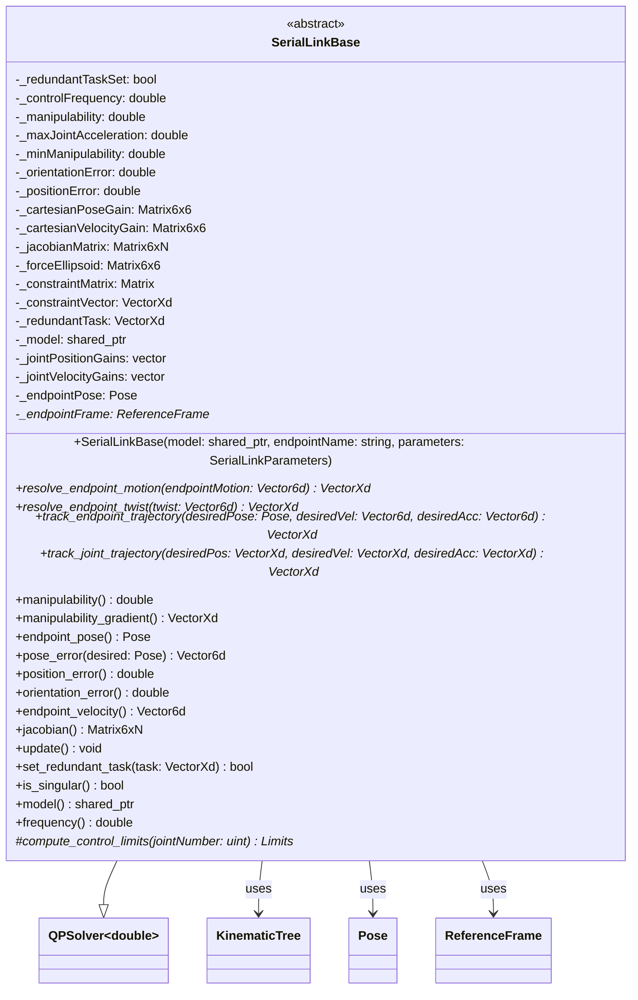
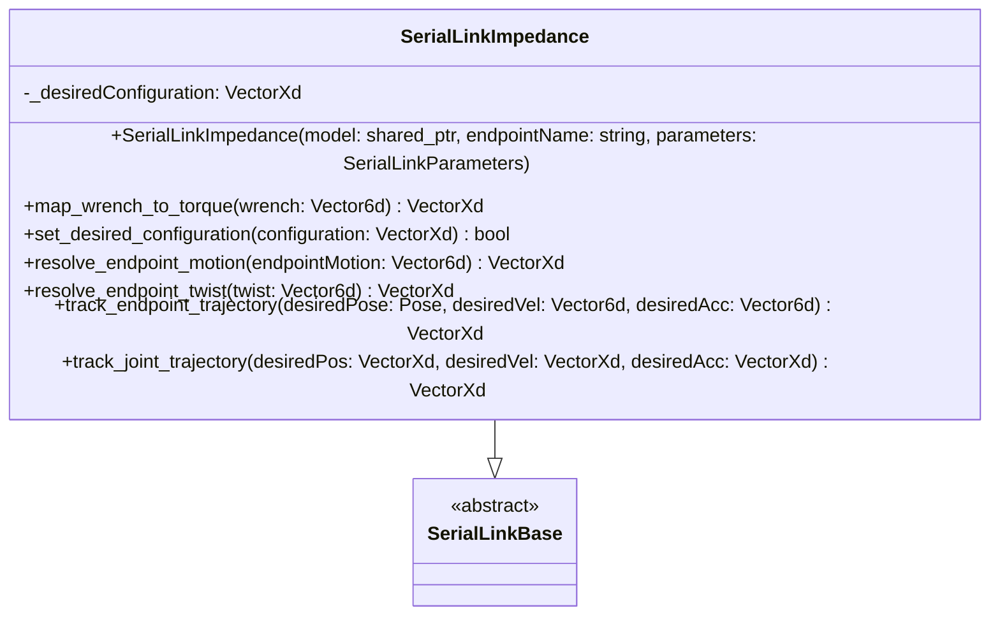
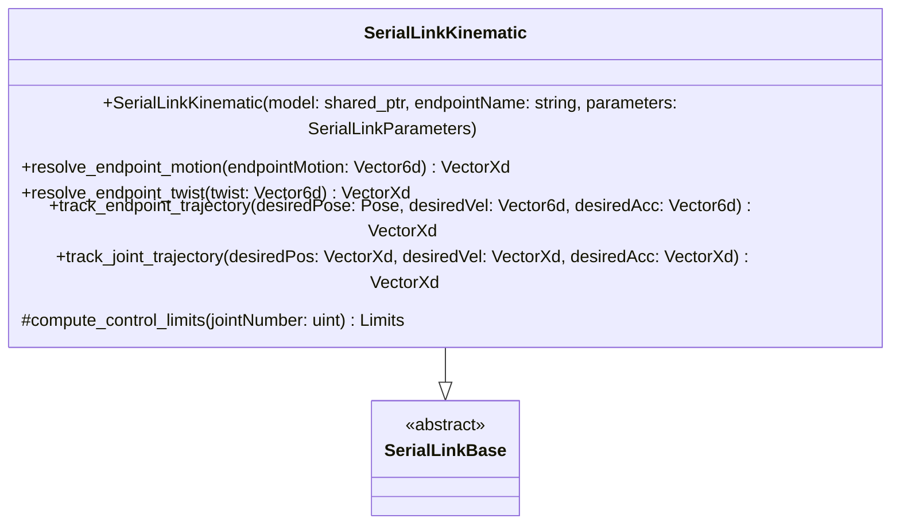

# Control Class Diagrams

[🔙 Back to Control](../README.md)

[🔙 Back to the Foyer](../../README.md)

#### 🧭 Navigation:
- [Data Structures](#data-structures)
- [SerialLink](#seriallink)
   - [SerialLinkBase](#seriallinkbase)
   - [SerialLinkImpedance](#seriallinkimpedance)
   - [SerialLinkKinematic](#seriallinkkinematic)
 
## Data Structures

[🔝 Back to Top](#control-class-diagrams)

## SerialLink

### SerialLinkBase

[🔝 Back to Top](#control-class-diagrams)

### SerialLinkImpedance

[🔝 Back to Top](#control-class-diagrams)

### SerialLinkKinematic

[🔝 Back to Top](#control-class-diagrams)

