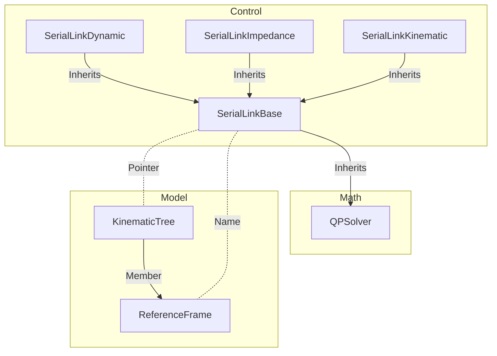
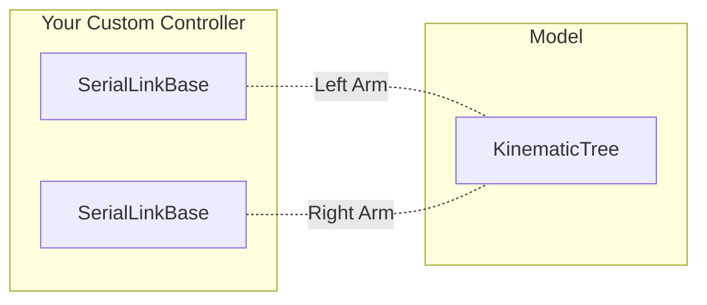

# Serial Link Base

[🔙 Back to Control](../README.md)

[🔙 Back to the Foyer](../../README.md)

#### 🧭 Navigation:
- [Overview](#overview)
- [Implementation](#implementation)

## Overview

The `SerialLinkBase` class is designed to give a common structure to all control classes for serial link robots. This way it is possible to command a robot in velocity or torque mode without having to change the motion planning for a given task.

As can be seen in the diagram below, it builds upon several important elements:
- It inherits a [QPSolver](https://github.com/Woolfrey/software_simple_qp) which is used by the child classes to optimise the control subject to constraints,
- It takes a pointer to a `RobotLibrary::Model::KinematicTree` object which it uses to access the current forward kinematics & inverse dynamics properties, and
- It requires the name of a `ReferenceFrame` on the `KinematicTree` object, which it uses for computing the Jacobian matrix during Cartesian control.



The use of the pointer to the `KinematicTree` is deliberate. In branching structures, such as humanoid robots, it is necessary to control multiple limbs. A single `SerialLinkBase` can be assigned to the endpoint of each limb. Each controller will compute its own unique Jacobian for independent control, but ensures that both utilise the same kinematics & dynamics properties.



[🔝 Back to top.](#serial-link-base)

## Implementation

One of the advantages of the base class is that you can switch to different types of controllers at runtime:
- `SerialLinkKinematic` for velocity control,
- `SerialLinkImpedance` for, as you guessed, impedance control, and
- `SerialLinkDynamic` for full torque control with inverse dynamics.

Below is an example of how it can be implemented:
```
// 1. Create the model
auto model = std::make_shared<RobotLibrary::Model::KinematicTree>("path/to/model.urdf");

// 2. Set the parameters
RobotLibrary::Control::SerialLinkParameters parameters;

// 3. Create an abstract class
std::shared_ptr<RobotLibrary::Control::SerialLinkBase> controller;

// 4. Generate a specific controller
switch (controlMode)
{
  case velocity:
    controller = std::make_shared<RobotLibrary::Control::SerialLinkKinematic>(model, "endpointName", parameters);
    break;

  case impedance:
    controller = std::make_shared<RobotLibrary::Control::SerialLinkImpedance>(model, "endpointName", parameters);
    break;

  case torque:
    controller = std::make_shared<RobotLibrary::Control::SerialLinkDynamic>(model, "endpointName", parameters);
    break;

  default:
    throw std::runtime_error("Unknown control mode!");
}
```

[🔝 Back to top.](#serial-link-base)
