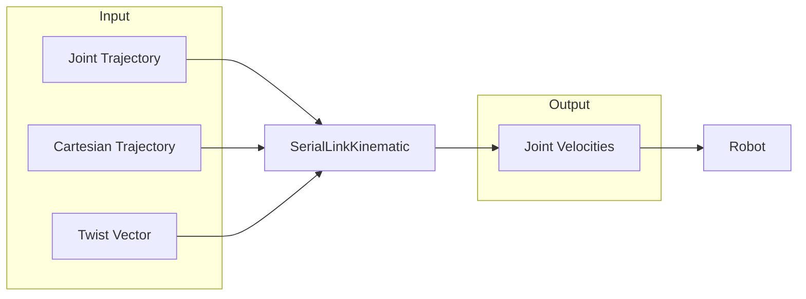
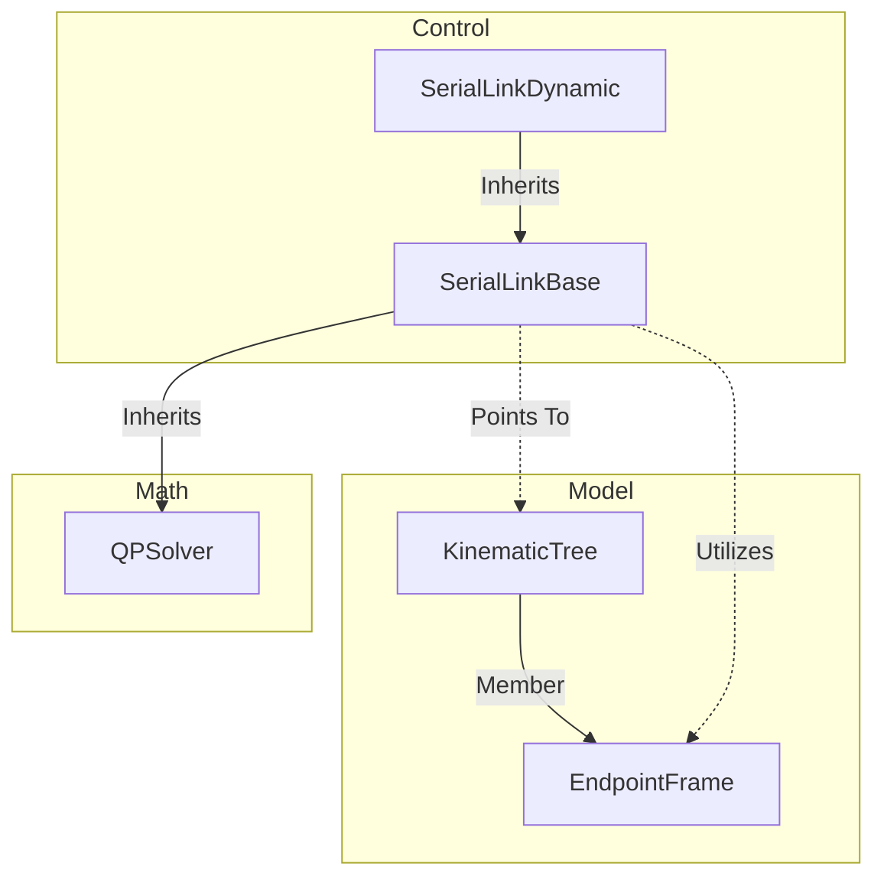

# Serial Link Dynamic

> [!WARNING]
> This class presumes you have an accurate dynamic model of the robot. If you do not, consider using the `SerialLinkImpedance` control class instead.

#### 🧭 Navigation
- [Overview](#overview)
- [Implementation](#implementation)
- [Joint Control Methods](#joint-control-methods)
- [Cartesian Control Methods](#cartesian-control-methods)
  - [Cartesian Trajectory Tracking](#cartesian-trajectory-tracking)
  - [Non-Redundant Robots](#non-redundant-robots)
  - [Redundant Robots](#redundant-robots)
  - [Singularities](#singularities)
- [References](#references)

## Overview

The `SerialLinkDynamic` class provides methods for real-time torque control in both joint and Cartesian space. There are methods for different types of tasks:
- A reference joint trajectory defined by:
   - $\mathbf{q}_d \in\mathbb{R}^n$: desired positions,
   - $\dot{\mathbf{q}}_d \in\mathbb{R}^n$: desired velocities, and
   - $\ddot{\mathbf{q}}_d \in\mathbb{R}^n$: desired joint accelerations,
- A reference Cartesian trajectory defined by:
   - $\mathbf{T}_d\in\mathbb{SE}(3)$: a desired endpoint pose, and
   - $\dot{\mathbf{x}}_d\in\mathbb{R}^6$, a desired endpoint twist, and
   - $\ddot{\mathbf{x}}_d\in\mathbb{R}^6$ a desired Cartesian acceleration, or
- A twist vector $\dot{\mathbf{x}}_d = [\mathbf{v}_d^T \boldsymbol{\omega}_d^T]^T$ where:
  - $\mathbf{v}_d\in\mathbb{R}^3$ is the linear velocity (m/s), and
  - $\boldsymbol{\omega}_d\in\mathbb{R}^3$ is the angular velocity (rad/s).

In each case, the controller computes the the joint torques $\boldsymbol{\tau}\in\mathbb{R}^n$  required to execute the task, subject to joint limits (position, velocity, and acceleration):



[:top: Back to top.](#serial-link-kinematic)

## Implementation

The `SerialLinkDynamic` class requires 2 things as a minimum:
1. A pointer to a `RobotLibrary::Model::KinematicTree` object, and
2. The name of the endpoint frame to be controlled.

It automatically inherits the `QPSolver` class via the `SerialLinkBase` class which is used to optimise the joint control in certain methods.



A minimum implementation would be as follows:

```
auto model = std::make_shared<RobotLibrary::Model::KinematicTree>("path/to/model.urdf");

RobotLibrary::Control::SerialLinkParameters parameters;
// Fill in parameters here.

auto controller = std::make_shared<RobotLibrary::Control::SerialLinkDynamic>(model, "endpointName", parameters);
```

You can set things like the joint feedback gains, Cartesian feedback gains, optimisation settings, etc. using the `SerialLinkParameters` data structure.

[:top: Back to top.](#serial-link-kinematic)

## Joint Control Methods

There is only 1 method for joint control; joint trajectory tracking.

### Joint Trajectory Tracking

Given a desired trajectory defined by:

 - $\mathbf{q}_d(t)\in\mathbb{R}^n$ the desired position,
 - $\dot{\mathbf{q}}_d(t)\in\mathbb{R}^n$ the desired velocity, and
 - $\ddot{\mathbf{q}}_d(t)\in\mathbb{R}^n$ the desired acceleration
 
 the torque to control the joint is computed as:

```math
  \boldsymbol{\tau} = \mathbf{M}(\mathbf{q})\Big(\ddot{\mathbf{q}}_d + \mathbf{D}_j\overbrace{(\dot{\mathbf{q}}_d - \dot{\mathbf{q}})}^{\dot{\boldsymbol{\epsilon}}} + \mathbf{K}_j\overbrace{(\mathbf{q}_d - \mathbf{q})}^{\boldsymbol{\epsilon}}\Big)
```
where:
- $\mathbf{M}(\mathbf{q})\in\mathbb{R}^{n\times n}$ is the joint inertia matrix,
- $\mathbf{D}_j\in\mathbb{R}^{n\times n}$ is a positive-definite gain matrix on the velocity error, and
- $\mathbf{K}_j\in\mathbb{R}^{n\times n}$ is a positive-definite gain matrix on the position error.

Using the above equation it can be shown that the tracking error follows a second order differential equation:

```math
\dot{\boldsymbol{\epsilon}} = -\mathbf{D}_j\dot{\boldsymbol{\epsilon}} - \mathbf{K}_j\boldsymbol{\epsilon}
```

which will exponentially decay with appropriate gain matrices.

The method automatically clamps the joint accelerations to avoid speed and position limits.

[:top: Back to top.](#serial-link-kinematic)

## Cartesian Control Methods

The forward kinematics of a serial link chain gives the endpoint position and orientation (pose) $\mathbf{T}\in\mathbb{SE}(3)$ as a function of its joint configuration $\mathbf{q}\in\mathbb{R}^n$:

```math
    \mathbf{T} = \mathbf{k}(\mathbf{q}) \in\mathbb{SE}(3)
```

For theoretical purposes we typically map this to a vector of position and orientation:

```math
  \mathbf{x} = \phi(\mathbf{T}) \in \mathbb{R}^6.
```

The forward kinematics is computed when you call the `update_state()` method on the associated `RobotLibrary::Model::KinematicTree` class.

If we take the time derivative of the forward kinematics we obtain:

```math
\begin{align}
\dot{\mathbf{x}} &= \overbrace{(\partial\mathbf{x}/\partial\mathbf{q})}^{\mathbf{J}(\mathbf{q})}\cdot\dot{\mathbf{q}} \\
\ddot{\mathbf{x}} &= \mathbf{J}(\mathbf{q})\ddot{\mathbf{q}} + \dot{\mathbf{J}}(\mathbf{q},\dot{\mathbf{q}})\dot{\mathbf{q}}
\end{align}
```

where $\mathbf{J}(\mathbf{q})\in\mathbb{R}^{m\times n}$ is the Jacobian matrix (partial derivatives of the forward kinematics).

> [!NOTE]
> You **must** call `update()` on the control class to compute a new Jacobian **after** using `update_state()` on the model.

[:top: Back to top.](#serial-link-kinematic)


#### Cartesian Velocity Control

Using the `resolve_endpoint_twist()` method we can direct the endpoint velocity. The twist vector is decomposed as:

```math
\dot{\mathbf{x}} = 
\begin{bmatrix}
    \mathbf{v} \\
    \boldsymbol{\omega}
\end{bmatrix}
```

where:
- $\mathbf{v}\in\mathbb{R}^3$ is the linear velocity (m/s), and
- $\boldsymbol{\omega}\in\mathbb{R}^3$ is the angular velocity (rad/s).

Given a desired twist $\mathbf{x}_d$ the acceleration is computed as:

```math
  \ddot{\mathbf{x}} = \mathbf{D}_c (\dot{\mathbf{x}}_d - \mathbf{J}\dot{\mathbf{q}}).
```

[:top: Back to top.](#serial-link-kinematic)

#### Cartesian Trajectory Tracking

When calling the `track_endpoint_trajectory()` method, the endoint velocity is computed as:

```math
    \ddot{\mathbf{x}} = \ddot{\mathbf{x}}_d + \mathbf{D}_c\overbrace{(\dot{\mathbf{x}}_d - \mathbf{J}\dot{\mathbf{q}})}^{\dot{\boldsymbol{\epsilon}}} +  \mathbf{K}_c\overbrace{\left(\mathbf{x}_d - \mathbf{x}(\mathbf{q})\right)}^{\boldsymbol{\epsilon}}
```

where:
  - $\mathbf{D}_c\in\mathbb{R}^{6\times 6}$ is a positive definite gain matrix on the twist error, and
  - $\mathbf{K}_c\in\mathbb{R}^{6\times 6}$ is a positive definite gain matrix on the pose error.

It can be shown that the error will follow a second order differential equation:

```math
  \ddot{\boldsymbol{\epsilon}}= -\mathbf{D}_c\dot{\boldsymbol{\epsilon}} - \mathbf{K}_c \boldsymbol{\epsilon}
```

which will exponentially decay with appropriate gain matrices.

The orientation error is computed using quaternion feedback[^1].

[^1]: Yuan, J. S. (1988). _Closed-loop manipulator control using quaternion feedback._ IEEE Journal on Robotics and Automation, 4(4), 434-440.

### Non-Redundant Robots

For a non redundant robot $n \le 6$, the joint accelerations are optimised using [quadratic programming (QP)](https://github.com/Woolfrey/software_simple_qp) to minimise the tracking error subject to constraints:

```math
\begin{align}
\min_{\ddot{\mathbf{q}}} \tfrac{1}{2}\left(\ddot{\mathbf{x}} - \dot{\mathbf{J}}\dot{\mathbf{q}} - \mathbf{J}\ddot{\mathbf{q}}\right)^T\left(\ddot{\mathbf{x}} - \dot{\mathbf{J}}\dot{\mathbf{q}} - \mathbf{J}\ddot{\mathbf{q}}\right) \\
\text{subject to: }
\ddot{\mathbf{q}}_{min} \le \ddot{\mathbf{q}} \le \ddot{\mathbf{q}}_{max} \\
\dot{\mu}(\mathbf{q},\dot{\mathbf{q}}) \ge -\gamma\cdot\left(\mu(\mathbf{q}) - \mu_{min}\right)
\end{align}
```

where:
- $\ddot{\mathbf{q}}_{min}$ is the lower bound on the joint speed to avoid limits,
- $\ddot{\mathbf{q}}_{max}$ is the upper bound,
- $\mu(\mathbf{q}):\mathbb{R}^n\mapsto\mathbb{R}^+$ is Yoshikawa's measure of manipulability[^2] (i.e. proximity to a singularity), and
- $\gamma\in\mathbb{R}^+$ is a scaling parameter.

The first set of constraints is for joint limit avoidance [^3], and the second set of constraints is a control barrier function (CBF) for singularity avoidance.

[^2]: Yoshikawa, T. (1985). Manipulability of robotic mechanisms. The international journal of Robotics Research, 4(2), 3-9.

[^3]: Flacco, F., De Luca, A., & Khatib, O. (2015). Control of redundant robots under hard joint constraints: Saturation in the null space. IEEE Transactions on Robotics, 31(3), 637-654.

### Redundant Robots

If the robot is redundant $n > 6$ then the following [quadratic programming (QP) problem](https://github.com/Woolfrey/software_simple_qp) is solved:

```math
\begin{align}
\min_{\ddot{\mathbf{q}}} \tfrac{1}{2}\left( \boldsymbol{\tau}_\varnothing - \mathbf{M}\ddot{\mathbf{q}} \right)^T \mathbf{M}^{-1} \left( \boldsymbol{\tau}_\varnothing - \mathbf{M}\ddot{\mathbf{q}} \right) \\
\text{subject to: } \mathbf{J}\ddot{\mathbf{q}} = \ddot{\mathbf{x}} - \dot{\mathbf{J}}\dot{\mathbf{q}} \\
\ddot{\mathbf{q}}_{min} \le \ddot{\mathbf{q}} \le \ddot{\mathbf{q}}_{max} \\
\dot{\mu}(\mathbf{q},\dot{\mathbf{q}}) \ge -\gamma\cdot\left(\mu(\mathbf{q}) - \mu_{min}\right)
\end{align}
```

where:
- $\mathbf{M}\in\mathbb{R}^{n\times n}$ is the joint inertia matrix, and
- $\dot{\mathbf{q}}_\varnothing\in\mathbb{R}^n$ are the joint velocities for acheiving a secondary task with kinematic redundancy.

> [!NOTE]
> The inertia matrix is assumed to be positive-definite, so you should ensure you have at least a _decent_ dynamic model of the robot.

You can use the `set_redundant_task()` method to specifiy your own, but it will be automatically reset after calling any of the Cartesian control methods to ensure validity in the next control step.

If a redundant task is not manually set, the robot will autonomously reconfigure itself away from singular configurations using:

```math
\dot{\mathbf{q}}_\varnothing = \tfrac{1}{10\cdot \sqrt{f}} \frac{\partial \mu}{\partial\mathbf{q}}
```

where $f\in\mathbb{R}^+$ is the control frequency, and $\partial\mu/\partial\mathbf{q}\in\mathbb{R}^n$ is the gradient of manipulability[^2].

[:top: Back to top.](#serial-link-kinematic)

### Singularities

If the control barrier function fails to prevent the robot entering a (near) singular configuration, the controller reverts to using dampled least squares (DLS) [^4]:

```math
\begin{align}
\min_{\dot{\mathbf{q}}} \tfrac{1}{2}\left(\dot{\mathbf{x}} - \mathbf{J}\dot{\mathbf{q}}\right)^T \mathbf{M}\left(\dot{\mathbf{x}} - \mathbf{J}\dot{\mathbf{q}}\right) + \tfrac{1}{2}\lambda^2 \dot{\mathbf{q}}^T\dot{\mathbf{q}} \\
\text{subject to: }
\dot{\mathbf{q}}_{min} \le \dot{\mathbf{q}} \le \dot{\mathbf{q}}_{max}
\end{align}
```

where $\lambda\in\mathbb{R}^+$ is analogous to a damping factor that paralyses high joint velocities near singular configurations:

```math
    \lambda^2 = \left(1 - \frac{\mu}{\mu_{min}}\right)^2\lambda_{max}^2.
```

This will sacrifice task accuracy in order to keep the joint velocities stable.

[^4]: Chiaverini, S., Egeland, O., & Kanestrom, R. K. (1991, June). Achieving user-defined accuracy with damped least-squares inverse kinematics. In Fifth International Conference on Advanced Robotics' Robots in Unstructured Environments (pp. 672-677). IEEE.

[:top: Back to top.](#serial-link-kinematic)

## References:
