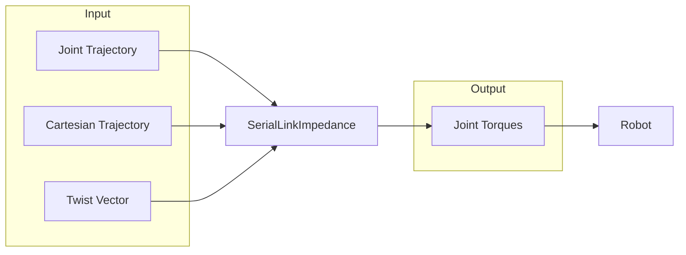
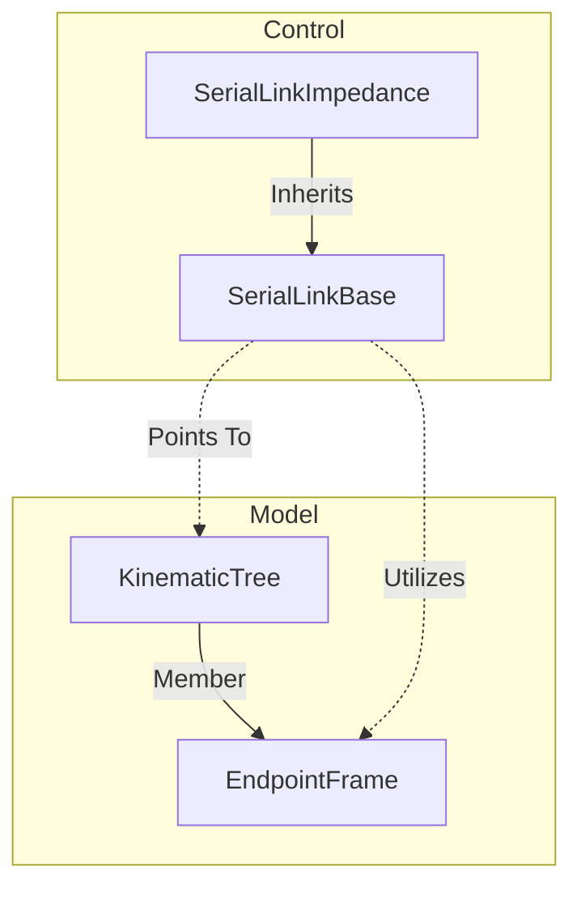

# Serial Link Impedance
[🔙 Back to Control](../README.md)

[🔙 Back to the Foyer](../../README.md)

#### 🧭 Navigation
- [Overview](#overview)
- [Implementation](#implementation)
- [Joint Control Methods](#joint-control-methods)
- [Cartesian Control Methods](#cartesian-control-methods)
  - [Cartesian Velocity Control](#cartesian-velocity-control)
  - [Cartesian Trajectory Tracking](#cartesian-trajectory-tracking)
  - [Singularities](#singularities)
- [References](#references)

## Overview

The `SerialLinkImpedance` class provides methods for joint and Cartesian space impedance control of serial link robot arms. There are methods for different types of tasks:
- A reference joint trajectory defined by:
   - $\mathbf{q}_d\in\mathbb{R}^n$: the desired position, and
   - $\dot{\mathbf{q}}_d \in\mathbb{R}^n$: the desired velocity,
- A reference Cartesian trajectory defined by:
   - $\mathbf{T}_d\in\mathbb{SE}(3)$: the desired pose, and
   - $\dot{\mathbf{x}}_d\in\mathbb{R}^6$: the desired twist, or
- A twist vector $\dot{\mathbf{x}}_d = [\mathbf{v}_d^T \boldsymbol{\omega}_d^T]^T$ where:
  - $\mathbf{v}_d\in\mathbb{R}^3$ is the linear velocity (m/s), and
  - $\boldsymbol{\omega}_d\in\mathbb{R}^3$ is the angular velocity (rad/s).

> [!TIP]
> You can generate joint and Cartesian trajectories using classes in the [Trajectory](../../Trajectory/README.md) sublibrary.

In each case, the controller computes the the joint torques required to execute the task.



[:top: Back to top.](#serial-link-impedance)

## Implementation

The `SerialLinkKinematic` class requires 2 things as a minimum:
1. A pointer to a `RobotLibrary::Model::KinematicTree` object, and
2. The name of the endpoint frame to be controlled.



A minimum implementation would be as follows:

```
auto model = std::make_shared<RobotLibrary::Model::KinematicTree>("path/to/model.urdf");

RobotLibrary::Control::SerialLinkParameters parameters;
// Fill in parameters here.

auto controller = std::make_shared<RobotLibrary::Control::SerialLinkKinematic>(model, "endpointName", parameters);
```

> [!NOTE]
> You can set things like the joint feedback gains, Cartesian feedback gains, optimisation settings, etc. using the `SerialLinkParameters` data structure.

[:top: Back to top.](#serial-link-impedance)

## Joint Control Methods

There is only 1 method for joint control; joint trajectory tracking.

### Joint Trajectory Tracking

Given a desired trajectory defined by:

 - $\mathbf{q}_d(t)\in\mathbb{R}^n$ the desired position, and
 - $\dot{\mathbf{q}}_d(t)\in\mathbb{R}^n$ the desired velocity,
 
the torque $\boldsymbol{\tau}\in\mathbb{R}^n$ to control the joints is computed as:

```math
\boldsymbol{\tau} = \mathbf{D}_q (\dot{\mathbf{q}}_d - \dot{\mathbf{q}}) + \mathbf{K}_q (\mathbf{q}_d - \mathbf{q})
```

where:

- $\mathbf{D}_q\in\mathbb{R}^{n\times n}$ is a positive-definite gain matrix on the velocity error, and
- $\mathbf{K}_q\in\mathbb{R}^{n\times n}$ is a positive-definite gain matrix on the position error.

This method automatically clamps the desired joint positions to avoid joint limits.

[:top: Back to top.](#serial-link-impedance)

## Cartesian Control Methods

> [!WARNING]
> The `SerialLinkImpedance` class cannot guarantee joint limit avoidance like the `SerialLinkKinematic` or `SerialLinkDynamic` classes in Cartesian control mode.

The forward kinematics of a serial link chain gives the endpoint position and orientation (pose) $\mathbf{T}\in\mathbb{SE}(3)$ as a function of its joint configuration $\mathbf{q}\in\mathbb{R}^n$:

```math
    \mathbf{T} = \mathbf{k}(\mathbf{q}) \in\mathbb{SE}(3)
```

which, for theoretical convenience, is mapped to a vector of position and orientation:

```math
  \mathbf{x} = \phi(\mathbf{T}) \in\mathbb{R}^6.
```

The forward kinematics is computed when you call the `update_state()` method on the associated `RobotLibrary::Model::KinematicTree` class.

If we take the time derivative of the forward kinematics we obtain:
```math
\dot{\mathbf{x}} = \overbrace{(\partial\mathbf{x}/\partial\mathbf{q})}^{\mathbf{J}(\mathbf{q})}\cdot\dot{\mathbf{q}}
```

where $\mathbf{J}(\mathbf{q})\in\mathbb{R}^{6\times n}$ is the Jacobian matrix (partial derivatives of the forward kinematics).

> [!NOTE]
> You **must** call `update()` on the control class to compute a new Jacobian **after** using `update_state()` on the model.

We can express the endpoint velocity as a twist vector:

```math
\dot{\mathbf{x}} = 
\begin{bmatrix}
    \mathbf{v} \\
    \boldsymbol{\omega}
\end{bmatrix}
```

where:
- $\mathbf{v}\in\mathbb{R}^3$ is the linear velocity (m/s), and
- $\boldsymbol{\omega}\in\mathbb{R}^3$ is the angular velocity (rad/s).

You can specify a desired endpoint velocity directly with the `resolve_endpoint_twist()` command.

We can define also define wrench acting on the endpoint of the robot arm as:

```math
  \mathbf{w} =
  \begin{bmatrix}
    \mathbf{f} \\
    \mathbf{m}
  \end{bmatrix} \in\mathbb{R}^6
```

where:
- $\mathbf{f}\in\mathbb{R}^3$ are the linear forces (N), and
- $\mathbf{m}\in\mathbb{R}^3$ are the moments (Nm).

The power exerted by the robot is then:

```math
\begin{align}
  \dot{\mathbf{q}}^T\boldsymbol{\tau} &= \dot{\mathbf{x}}^T\mathbf{w} \\
                                      &= \dot{\mathbf{q}}^T\mathbf{J}^T\mathbf{w}
\end{align}
```

so the joint torques $\boldsymbol{\tau}$ that the wrench induces on the endpoint are:

```math
  \boldsymbol{\tau} = \mathbf{J}^T\mathbf{w}.
```

This equation is used to dictate the endpoint control. More specifically, it is expanded to include any potential kinematic redundancy:

```math
  \boldsymbol{\tau} = \mathbf{J}^T\mathbf{w} + \mathbf{N}^T \boldsymbol{\tau}_{\varnothing}
```

where:
- $\mathbf{N}\in\mathbb{R}^{n\times n}$ is the null space projection matrix, and
- $\boldsymbol{\tau}_\varnothing$ is a redundant task.

The null space projection matrix is such that:
```math
  \mathbf{N}^T\mathbf{J}^T = \mathbf{0}
```

meainging it is orthogonal to the Jacobian, and
```math
  \mathbf{N}^T\mathbf{N}^T = \mathbf{N}^T
```

meaning it is idempotent.

The redundant task is defined to keep the joints in the middle of their limits:

```math
  \boldsymbol{\tau}_\varnothing = \tfrac{1}{2} \mathbf{K}_q(\mathbf{q}_{min} + \mathbf{q}_{max}) - \mathbf{D}_q \dot{\mathbf{q}}.
```

> [!NOTE]
> The current implementation uses a fixed redundant task to keep the joints away from their position limits. Future work will enable specifying a desired configuration.

[:top: Back to top.](#serial-link-impedance)

#### Cartesian Velocity Control

Given a desired endpoint twist $\dot{\mathbf{x}}_d\in\mathbb{R}^6$, the endpoint wrench is computed as:

```math
  \mathbf{w} = \mathbf{D}_x (\dot{\mathbf{x}}_d - \mathbf{J}\dot{\mathbf{q}})
```

where $\mathbf{D}_x\in\mathbb{R}^{6\times 6}$ is a positive definite gain matrix on the twist error.

#### Cartesian Trajectory Tracking

When calling the `track_endpoint_trajectory()` method, the endoint wrench is computed as:

```math
    \mathbf{w} = \mathbf{D}_x (\dot{\mathbf{x}}_d - \mathbf{J}\dot{\mathbf{q}}) + \mathbf{K}_x (\mathbf{x}_d - \mathbf{k}(\mathbf{q}))
```

where:
- $\mathbf{D}_x\in\mathbb{R}^{6\times 6}$ is a positive definite gain matrix on the twist error, and
- $\mathbf{K}_x\in\mathbb{R}^{6\times 6}$ is a positive definite gain matrix on the pose error.

The orientation error is computed using quaternion feedback[^1].

[^1]: Yuan, J. S. (1988). _xlosed-loop manipulator control using quaternion feedback._ IEEE Journal on Robotics and Automation, 4(4), 434-440.


[:top: Back to top.](#serial-link-impedance)

### Singularities

The `SerialLinkImpedance` class does not suffer from singularities.

Singularities arise when trying to calculate the inverse of the Jacobian matrix $\mathbf{J}^\dagger$ in particular configurations.

This class does not invert the Jacobian, so there are no problems 😉

[:top: Back to top.](#serial-link-impedance)

## References:
